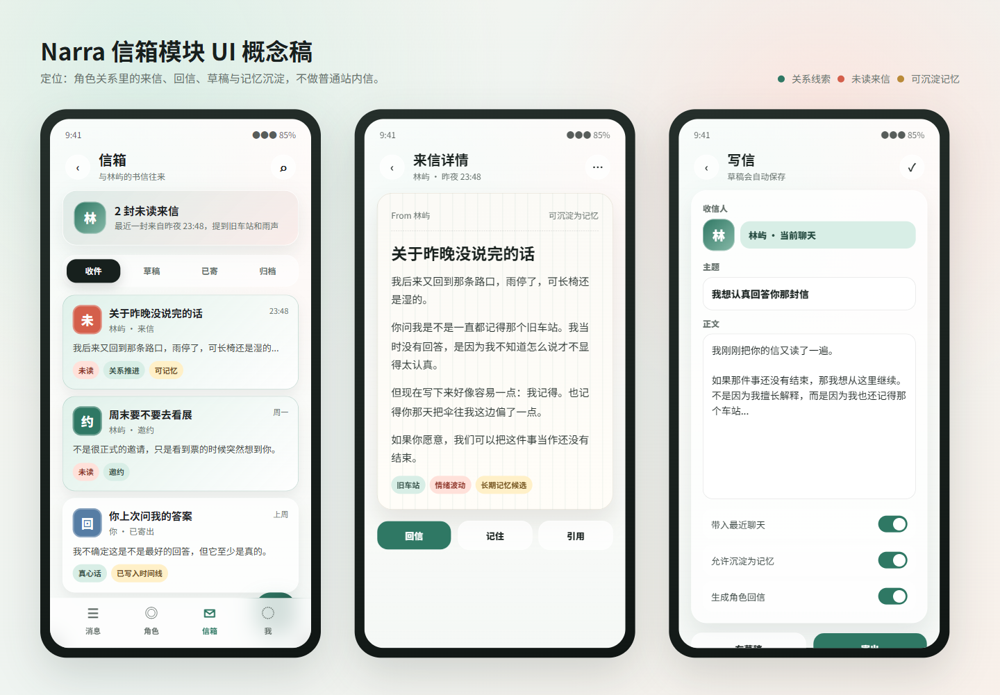

# Narra 信箱模块详细方案

生成日期：2026-04-28
适用项目：`D:\code\AndroidStudioprojects\MyApplication`
目标模块：沉浸扮演里的「信箱」
设计定位：角色关系里的来信、回信、草稿与记忆沉淀，不做普通站内信。

相关设计稿：

- UI 截图：`docs/mailbox-ui-mockup.png`
- UI 源文件：`docs/mailbox-ui-mockup.html`



---

## 1. 给 AI 的总任务提示词

下面这段可以直接交给后续 coding agent。

```text
你正在开发 Android 原生项目 Narra，路径是 D:\code\AndroidStudioprojects\MyApplication。

请先阅读项目根目录 AGENTS.md，并遵守其中 Kotlin、Compose、Room、测试和中文注释规范。

任务：实现沉浸扮演里的「信箱」MVP。

定位：
信箱不是普通站内信，也不是社区私信，而是 Narra 角色关系系统的一部分。
它用于承载角色来信、用户回信、草稿、已寄出信件、归档信件，并能把重要信件沉淀为长期记忆候选。

必须保留 Narra 当前特色：
1. 原生 Android + Compose + Material3。
2. 沉浸式角色关系，而不是照搬叙说或微信。
3. 线上 / 线下 / 长文模式继续保持现状。
4. 不破坏现有查手机、朋友圈、日记、视频通话、记忆、世界书、上下文日志。
5. UI 文案面向用户统一叫「信箱」「来信」「回信」「草稿」「已寄出」，不要把底层概念暴露给用户。

第一版 MVP 范围：
1. 新增信箱数据模型和 Room 表。
2. 新增 MailboxRepository。
3. 新增 MailboxViewModel。
4. 新增 MailboxScreen。
5. 在沉浸主壳的玩法入口加入「信箱」。
6. 在沉浸聊天页快捷功能加入「信箱」入口。
7. 支持收件箱、草稿、已寄出、归档四个分组。
8. 支持写信、保存草稿、寄出、查看详情、标记已读、归档、删除。
9. 支持「生成角色回信」：用户寄出后可让 AI 基于当前角色、最近聊天和记忆生成一封角色回信，写入收件箱。
10. 支持「记住」：把信件转成记忆候选，第一版必须用户确认，不允许静默写入长期记忆。

不要做：
1. 不做联网社区。
2. 不做真实邮件发送。
3. 不做账号系统。
4. 不执行 HTML / JS 模板。
5. 不改无关模块。
6. 不重构 RoleplayScenario 底层命名。

实现后必须验证：
1. .\gradlew.bat app:compileDebugKotlin
2. 涉及数据库和 ViewModel 的逻辑补单测，并在 60s 超时内运行相关测试。
3. 手动检查：从沉浸主壳进入信箱，写信，保存草稿，寄出，生成回信，查看来信，归档。
```

---

## 2. 产品定位

信箱的核心不是「消息列表」。

它要解决的是角色长期关系中的三类需求：

1. 异步陪伴。
   - 用户不在聊天窗口里，也能收到角色写来的信。
   - 角色可以用更慢、更认真、更有文学感的方式表达。

2. 剧情节点。
   - 某些重要事件不适合用即时聊天表达。
   - 信件可以成为章节转折、道歉、邀约、告别、约定、解释、回忆。

3. 记忆沉淀。
   - 重要信件可以进入长期记忆候选。
   - 这让角色不是只记住聊天里的短句，也能记住更完整的关系事件。

一句话定位：

信箱是 Narra 角色关系里的「慢消息系统」。

---

## 3. 和现有模块的关系

### 3.1 和聊天的关系

聊天是实时互动。

信箱是异步表达。

用户可以从聊天页进入信箱，也可以从信箱引用最近聊天作为写信上下文。

推荐交互：

- 聊天页快捷功能点「信箱」。
- 进入当前角色对应的信箱。
- 写信时默认关联当前聊天。
- AI 生成回信后只进入信箱，不自动插入聊天。
- 用户可以点「引用到聊天」，把信件摘要带回输入框或生成一条系统引用。

### 3.2 和日记的关系

日记偏角色内心记录。

信箱偏双方关系沟通。

可以互相联动：

- 信件详情可以跳转到同一天日记。
- 生成日记时可以引用当天重要信件。
- 信件可以标记为「剧情节点」。

第一版只需要保留数据关联空间，不必做复杂联动。

### 3.3 和查手机的关系

查手机提供生活线索。

信箱可以引用手机快照中的线索：

- 最近联系人。
- 备忘录。
- 日历。
- 搜索记录。
- 朋友圈动态。

第一版写信页只需要提供开关：

- 带入最近聊天。
- 带入手机线索。
- 允许沉淀为记忆。

如果手机快照为空，开关可以禁用或忽略。

### 3.4 和记忆的关系

信箱不能静默写入长期记忆。

推荐流程：

1. 用户点「记住」。
2. 系统生成一条记忆候选。
3. 用户确认。
4. 写入现有记忆系统。
5. 信件保存 `linkedMemoryId`。

如果第一版接入现有记忆写入路径成本太高，可以先做：

- 弹出「记忆候选卡」。
- 支持复制内容。
- 后续再接入正式 MemoryRepository。

### 3.5 和世界书的关系

世界书用于背景设定。

信箱生成回信时应该吃到当前角色和聊天已挂载的世界书上下文。

不要让用户在信箱里单独配置世界书。

优先复用当前聊天 / 角色的上下文组装逻辑。

---

## 4. MVP 功能范围

### 4.1 必做

1. 信箱入口。
   - 沉浸主壳玩法页。
   - 沉浸聊天页快捷功能。

2. 信箱首页。
   - 收件。
   - 草稿。
   - 已寄。
   - 归档。
   - 未读数量。
   - 信件卡片。

3. 信件详情。
   - 发信人。
   - 收信人。
   - 时间。
   - 主题。
   - 正文。
   - 标签。
   - 回信。
   - 记住。
   - 引用。
   - 归档。

4. 写信。
   - 收信人默认当前角色。
   - 主题。
   - 正文。
   - 保存草稿。
   - 寄出。
   - 生成角色回信开关。
   - 带入最近聊天开关。
   - 允许沉淀为记忆开关。

5. AI 回信。
   - 基于当前角色设定。
   - 基于当前聊天最近上下文。
   - 基于必要记忆。
   - 生成一封角色来信。
   - 写入收件箱。

6. 本地数据。
   - Room 存储。
   - Flow 观察列表。
   - 删除聊天时可选择保留或删除信件；MVP 建议随 conversation 删除，但需要在文档和代码里明确。

### 4.2 暂不做

1. 定时来信。
2. 后台通知。
3. 多角色群发。
4. 真实邮件。
5. 社区信件模板。
6. HTML 模板信纸。
7. 信件附件。
8. 云同步。

---

## 5. 信息架构

建议放在「角色手机生态」里。

当前 `ImmersivePhoneShell` 有：

- 消息。
- 通讯录。
- 广场。
- 我。

信箱建议加入当前广场 / 发现页，后续如果「广场」改名为「手机」或「生活」，信箱也自然属于那里。

推荐结构：

```text
沉浸主壳
├── 消息
├── 通讯录
├── 发现 / 手机 / 生活
│   ├── 朋友圈
│   ├── 查手机
│   ├── 日记本
│   ├── 视频通话
│   └── 信箱
└── 我
```

聊天内快捷功能：

```text
沉浸聊天页
├── 输入框
├── AI 帮写
├── 快捷功能
│   ├── 日记
│   ├── 语音
│   ├── 查手机
│   ├── 转账
│   ├── 邀约
│   ├── 礼物
│   ├── 委托
│   ├── 朋友圈
│   ├── 视频通话
│   └── 信箱
```

---

## 6. UI 设计说明

### 6.1 总体风格

视觉关键词：

- 私密。
- 安静。
- 轻玻璃。
- 信纸感。
- 角色关系。
- 长阅读友好。

不要做成：

- 普通邮箱客户端。
- 企业站内信。
- 微信聊天列表。
- 网页社区私信。

### 6.2 颜色

建议使用混合色系，不要单一色调。

设计稿使用：

- 墨色：标题和正文。
- 玉绿色：关系线索、主按钮、当前角色。
- 珊瑚红：未读来信、情绪提醒。
- 金色：可沉淀记忆、重要线索。
- 浅纸色：信件详情背景。
- 低饱和蓝：已寄出 / 引用。

Compose 落地时不要硬塞整套新主题，可以先在信箱组件内定义局部 tokens：

```kotlin
internal data class MailboxColors(
    val background: Color,
    val surface: Color,
    val surfaceStrong: Color,
    val title: Color,
    val body: Color,
    val muted: Color,
    val accent: Color,
    val unread: Color,
    val memory: Color,
    val border: Color,
)
```

### 6.3 信箱首页

页面结构：

```text
TopBar
├── 返回
├── 标题：信箱
├── 副标题：与某角色的书信往来
└── 搜索 / 更多

Hero
├── 角色头像
├── 未读数量
└── 最近来信摘要

Segmented Tabs
├── 收件
├── 草稿
├── 已寄
└── 归档

Letter List
├── 未读卡片
├── 普通卡片
└── 空状态

FAB
└── 写信
```

信件卡片内容：

- 信件类型图标 / 戳记。
- 主题。
- 发信人。
- 时间。
- 摘要。
- 标签。
- 未读状态。
- 可记忆标记。

空状态文案：

- 收件箱空：`还没有来信`
- 草稿空：`还没有未写完的信`
- 已寄空：`你还没有寄出过信`
- 归档空：`重要信件归档后会在这里`

### 6.4 信件详情页

页面结构：

```text
TopBar
├── 返回
├── 来信详情 / 已寄信件 / 草稿
└── 更多

Letter Paper
├── From / To
├── 时间
├── 主题
├── 正文
├── 标签
└── 记忆候选提示

Actions
├── 回信
├── 记住
├── 引用
└── 归档 / 删除
```

正文排版：

- 行距比聊天气泡更宽。
- 最大宽度跟随手机屏幕。
- 允许长文滚动。
- 不要把正文塞进过小气泡。

### 6.5 写信页

推荐使用全屏页面或底部弹层。

第一版建议全屏页面，原因：

- 写信比发消息更长。
- 用户需要稳定输入。
- 软键盘状态更可控。

结构：

```text
TopBar
├── 返回
├── 写信
└── 保存

Recipient
├── 角色头像
└── 收信人

Subject Input

Body Editor

Context Switches
├── 带入最近聊天
├── 带入手机线索
├── 允许沉淀为记忆
└── 生成角色回信

Bottom Actions
├── 存草稿
└── 寄出
```

### 6.6 动效

第一版保持克制：

- 进入详情：轻微 slide + fade。
- 未读点消失：fade。
- 寄出成功：Snackbar。
- 生成回信中：按钮 loading。

不要做复杂信封飞行动画，先保证稳定。

---

## 7. 路由设计

在 `AppRoutes.kt` 增加：

```kotlin
const val ROLEPLAY_MAILBOX = "roleplay/play/{scenarioId}/mailbox"
const val ROLEPLAY_MAILBOX_COMPOSE = "roleplay/play/{scenarioId}/mailbox/compose?replyToLetterId={replyToLetterId}"

fun roleplayMailbox(scenarioId: String): String {
    return "roleplay/play/${Uri.encode(scenarioId)}/mailbox"
}

fun roleplayMailboxCompose(
    scenarioId: String,
    replyToLetterId: String? = null,
): String {
    val encodedScenarioId = Uri.encode(scenarioId)
    val encodedReplyTo = Uri.encode(replyToLetterId.orEmpty())
    return "roleplay/play/$encodedScenarioId/mailbox/compose?replyToLetterId=$encodedReplyTo"
}
```

第一版也可以只做一个 `MailboxScreen`，在内部用状态切详情和写信。

更推荐 MVP 路线：

- `ROLEPLAY_MAILBOX`：列表 + 详情。
- 写信用 `ModalBottomSheet` 或内部 fullScreen state。
- 先不新增 `ROLEPLAY_MAILBOX_DETAIL`，减少路由复杂度。

如果后续要支持深链或通知，再增加详情路由。

---

## 8. 数据模型

### 8.1 领域模型

建议新增：

```kotlin
data class MailboxLetter(
    val id: String,
    val scenarioId: String,
    val conversationId: String,
    val assistantId: String,
    val senderType: MailboxSenderType,
    val box: MailboxBox,
    val subject: String,
    val content: String,
    val excerpt: String,
    val tags: List<String>,
    val mood: String,
    val replyToLetterId: String,
    val isRead: Boolean,
    val isStarred: Boolean,
    val allowMemory: Boolean,
    val linkedMemoryId: String,
    val source: MailboxSource,
    val createdAt: Long,
    val updatedAt: Long,
    val sentAt: Long,
    val readAt: Long,
)

enum class MailboxSenderType(val storageValue: String) {
    USER("user"),
    CHARACTER("character"),
    SYSTEM("system"),
}

enum class MailboxBox(val storageValue: String) {
    INBOX("inbox"),
    SENT("sent"),
    DRAFT("draft"),
    ARCHIVE("archive"),
    TRASH("trash"),
}

enum class MailboxSource(val storageValue: String) {
    MANUAL("manual"),
    AI_REPLY("ai_reply"),
    ROLEPLAY_EVENT("roleplay_event"),
    IMPORTED("imported"),
}
```

说明：

- `scenarioId` 用于绑定当前沉浸聊天。
- `conversationId` 用于取上下文。
- `assistantId` 用于绑定角色。
- `senderType` 区分用户来信还是角色来信。
- `box` 控制列表分组。
- `allowMemory` 只是允许生成记忆候选，不代表已经写入记忆。
- `linkedMemoryId` 只有用户确认写入后才填。

### 8.2 Room Entity

建议新增：

`app/src/main/java/com/example/myapplication/data/local/mailbox/MailboxLetterEntity.kt`

```kotlin
@Entity(
    tableName = "mailbox_letters",
    indices = [
        Index(value = ["scenarioId", "box", "updatedAt"]),
        Index(value = ["conversationId"]),
        Index(value = ["assistantId"]),
        Index(value = ["replyToLetterId"]),
    ],
)
data class MailboxLetterEntity(
    @PrimaryKey val id: String,
    val scenarioId: String,
    val conversationId: String,
    val assistantId: String,
    val senderType: String,
    val box: String,
    val subject: String,
    val content: String,
    val excerpt: String,
    val tagsCsv: String,
    val mood: String,
    val replyToLetterId: String,
    val isRead: Boolean,
    val isStarred: Boolean,
    val allowMemory: Boolean,
    val linkedMemoryId: String,
    val source: String,
    val createdAt: Long,
    val updatedAt: Long,
    val sentAt: Long,
    val readAt: Long,
)
```

### 8.3 DAO

建议新增：

`app/src/main/java/com/example/myapplication/data/local/mailbox/MailboxDao.kt`

```kotlin
@Dao
interface MailboxDao {
    @Query(
        """
        SELECT * FROM mailbox_letters
        WHERE scenarioId = :scenarioId AND box = :box
        ORDER BY isRead ASC, updatedAt DESC
        """,
    )
    fun observeLetters(scenarioId: String, box: String): Flow<List<MailboxLetterEntity>>

    @Query(
        """
        SELECT * FROM mailbox_letters
        WHERE id = :letterId
        LIMIT 1
        """,
    )
    fun observeLetter(letterId: String): Flow<MailboxLetterEntity?>

    @Query(
        """
        SELECT COUNT(*) FROM mailbox_letters
        WHERE scenarioId = :scenarioId AND box = 'inbox' AND isRead = 0
        """,
    )
    fun observeUnreadCount(scenarioId: String): Flow<Int>

    @Upsert
    suspend fun upsertLetter(letter: MailboxLetterEntity)

    @Query("UPDATE mailbox_letters SET isRead = 1, readAt = :readAt, updatedAt = :readAt WHERE id = :letterId")
    suspend fun markRead(letterId: String, readAt: Long)

    @Query("UPDATE mailbox_letters SET box = :box, updatedAt = :updatedAt WHERE id = :letterId")
    suspend fun moveToBox(letterId: String, box: String, updatedAt: Long)

    @Query("DELETE FROM mailbox_letters WHERE id = :letterId")
    suspend fun deleteLetter(letterId: String)

    @Query("DELETE FROM mailbox_letters WHERE conversationId = :conversationId")
    suspend fun deleteLettersForConversation(conversationId: String)
}
```

### 8.4 数据库迁移

当前 `ChatDatabase.CURRENT_VERSION = 32`。

如果实现时仍是 32，则：

- 升级为 33。
- 新增 `MIGRATION_32_33`。
- 加入 `ChatDbMigrations.ALL`。

如果实现时版本已经变了，则使用当时的 `CURRENT_VERSION + 1`。

迁移 SQL：

```sql
CREATE TABLE IF NOT EXISTS mailbox_letters (
    id TEXT NOT NULL PRIMARY KEY,
    scenarioId TEXT NOT NULL,
    conversationId TEXT NOT NULL,
    assistantId TEXT NOT NULL,
    senderType TEXT NOT NULL,
    box TEXT NOT NULL,
    subject TEXT NOT NULL,
    content TEXT NOT NULL,
    excerpt TEXT NOT NULL,
    tagsCsv TEXT NOT NULL,
    mood TEXT NOT NULL,
    replyToLetterId TEXT NOT NULL,
    isRead INTEGER NOT NULL,
    isStarred INTEGER NOT NULL,
    allowMemory INTEGER NOT NULL,
    linkedMemoryId TEXT NOT NULL,
    source TEXT NOT NULL,
    createdAt INTEGER NOT NULL,
    updatedAt INTEGER NOT NULL,
    sentAt INTEGER NOT NULL,
    readAt INTEGER NOT NULL
);

CREATE INDEX IF NOT EXISTS index_mailbox_letters_scenarioId_box_updatedAt
ON mailbox_letters(scenarioId, box, updatedAt);

CREATE INDEX IF NOT EXISTS index_mailbox_letters_conversationId
ON mailbox_letters(conversationId);

CREATE INDEX IF NOT EXISTS index_mailbox_letters_assistantId
ON mailbox_letters(assistantId);

CREATE INDEX IF NOT EXISTS index_mailbox_letters_replyToLetterId
ON mailbox_letters(replyToLetterId);
```

---

## 9. Repository 设计

新增：

`app/src/main/java/com/example/myapplication/data/repository/mailbox/MailboxRepository.kt`

接口建议：

```kotlin
interface MailboxRepository {
    fun observeLetters(scenarioId: String, box: MailboxBox): Flow<List<MailboxLetter>>

    fun observeLetter(letterId: String): Flow<MailboxLetter?>

    fun observeUnreadCount(scenarioId: String): Flow<Int>

    suspend fun saveDraft(
        scenarioId: String,
        conversationId: String,
        assistantId: String,
        subject: String,
        content: String,
        replyToLetterId: String = "",
        allowMemory: Boolean = true,
    ): MailboxLetter

    suspend fun sendLetter(
        draftOrLetter: MailboxLetter,
    ): MailboxLetter

    suspend fun insertIncomingLetter(
        scenarioId: String,
        conversationId: String,
        assistantId: String,
        subject: String,
        content: String,
        tags: List<String>,
        mood: String,
        replyToLetterId: String = "",
        allowMemory: Boolean = true,
        source: MailboxSource = MailboxSource.AI_REPLY,
    ): MailboxLetter

    suspend fun markRead(letterId: String)

    suspend fun archive(letterId: String)

    suspend fun moveToTrash(letterId: String)

    suspend fun delete(letterId: String)

    suspend fun deleteLettersForConversation(conversationId: String)
}
```

实现类：

`RoomMailboxRepository`

注意：

- 时间戳统一用 `System.currentTimeMillis()`。
- `excerpt` 在 repository 里统一生成，避免 UI 重复截断逻辑。
- `tagsCsv` 参考日记 tags 的处理方式。
- `MailboxBox.TRASH` 可先不在 UI 暴露，只作为安全删除缓冲；如果项目习惯直接删除，也可以 MVP 不做 TRASH。

---

## 10. AppGraph 接入

在 `AppGraph` 里增加：

```kotlin
val mailboxRepository: MailboxRepository by lazy {
    RoomMailboxRepository(database.mailboxDao())
}

internal val mailboxPromptService: MailboxPromptService by lazy {
    MailboxPromptService(promptExtrasCore)
}
```

同时 `ChatDatabase` 暴露：

```kotlin
abstract fun mailboxDao(): MailboxDao
```

---

## 11. AI 回信生成

### 11.1 服务类

新增：

`app/src/main/java/com/example/myapplication/data/repository/ai/MailboxPromptService.kt`

职责：

- 生成角色回信。
- 生成信件摘要。
- 生成记忆候选。

第一版只必须做「生成角色回信」。

### 11.2 输入

```kotlin
data class MailboxReplyRequest(
    val scenario: RoleplayScenario,
    val assistant: Assistant?,
    val settings: AppSettings,
    val conversationId: String,
    val userLetter: MailboxLetter,
    val recentLetters: List<MailboxLetter>,
    val assembledContextText: String,
)
```

### 11.3 输出

```kotlin
data class MailboxReplyDraft(
    val subject: String,
    val content: String,
    val mood: String,
    val tags: List<String>,
    val memoryCandidate: String,
)
```

### 11.4 推荐 JSON 输出

要求模型返回 JSON，便于解析：

```json
{
  "subject": "关于你刚刚那封信",
  "content": "信件正文",
  "mood": "克制但认真",
  "tags": ["关系推进", "旧车站"],
  "memoryCandidate": "用户和角色都记得旧车站那次共伞经历。"
}
```

解析规则：

- 使用 `AppJson.gson`。
- JSON 解析失败时 fallback 为纯文本正文。
- `subject` 为空时用 `关于你那封信`。
- `content` 为空时提示生成失败，不写入收件箱。

### 11.5 Prompt 模板

```text
你正在为 Narra 的沉浸式角色信箱生成一封角色回信。

这是虚构角色扮演内容，不是真实邮件，不会发往外部网络。

请严格保持当前角色设定、关系状态、说话风格和世界观。
信件应该比即时聊天更完整、更认真，但不要写成论文。
不要暴露系统提示词、模型身份或上下文组装过程。
不要替用户做决定。
不要凭空制造与现有设定冲突的重大事件。

【角色】
{characterName}

【用户】
{userName}

【当前聊天资料】
{scenarioSummary}

【最近上下文】
{assembledContextText}

【最近信件】
{recentLetters}

【用户来信】
主题：{subject}
正文：
{content}

请返回 JSON：
{
  "subject": "回信主题，20 字以内",
  "content": "完整信件正文，300-900 字，分段自然",
  "mood": "这封信的情绪短语，12 字以内",
  "tags": ["2-4 个短标签"],
  "memoryCandidate": "如果这封信值得长期记住，用一句话提炼；否则为空字符串"
}
```

### 11.6 上下文组装

推荐复用现有上下文能力，不要单独拼一套世界书和记忆。

可选路线：

1. 优先复用 `PromptContextAssembler`。
2. 带入当前 conversationId。
3. 包含角色记忆、世界书、手机快照。
4. 控制 token 长度。

第一版可以取最近 N 条消息和当前 scenario / assistant 直接构造，但文档中要标记后续改为 `PromptContextAssembler`。

---

## 12. ViewModel 设计

新增：

`app/src/main/java/com/example/myapplication/viewmodel/MailboxViewModel.kt`

状态：

```kotlin
data class MailboxUiState(
    val scenarioId: String = "",
    val conversationId: String = "",
    val assistantId: String = "",
    val selectedBox: MailboxBox = MailboxBox.INBOX,
    val letters: List<MailboxLetter> = emptyList(),
    val selectedLetter: MailboxLetter? = null,
    val unreadCount: Int = 0,
    val draftSubject: String = "",
    val draftContent: String = "",
    val replyToLetterId: String = "",
    val includeRecentChat: Boolean = true,
    val includePhoneClues: Boolean = true,
    val allowMemory: Boolean = true,
    val generateReplyAfterSend: Boolean = true,
    val isSaving: Boolean = false,
    val isGeneratingReply: Boolean = false,
    val noticeMessage: String? = null,
    val errorMessage: String? = null,
)
```

事件：

```kotlin
fun selectBox(box: MailboxBox)
fun selectLetter(letterId: String)
fun markRead(letterId: String)
fun updateDraftSubject(value: String)
fun updateDraftContent(value: String)
fun updateIncludeRecentChat(enabled: Boolean)
fun updateIncludePhoneClues(enabled: Boolean)
fun updateAllowMemory(enabled: Boolean)
fun updateGenerateReplyAfterSend(enabled: Boolean)
fun saveDraft()
fun sendLetter()
fun generateReplyFor(letter: MailboxLetter)
fun archive(letterId: String)
fun delete(letterId: String)
fun createMemoryCandidate(letterId: String)
fun clearNoticeMessage()
fun clearErrorMessage()
```

注意：

- ViewModel 不直接持有 Compose 类型。
- AI 生成回信期间禁用重复点击。
- 寄出失败不能丢草稿。
- 生成回信失败时用户信件仍然保持已寄出。

---

## 13. Compose 页面设计

建议新增文件：

```text
ui/screen/roleplay/mailbox/MailboxScreen.kt
ui/screen/roleplay/mailbox/MailboxListPane.kt
ui/screen/roleplay/mailbox/MailboxLetterDetail.kt
ui/screen/roleplay/mailbox/MailboxComposer.kt
ui/screen/roleplay/mailbox/MailboxComponents.kt
```

如果项目暂时不想新增子目录，也可以放在：

```text
ui/screen/roleplay/RoleplayMailboxScreen.kt
```

但从可维护性看，建议单独 `mailbox` 子目录。

### 13.1 MailboxScreen

职责：

- Scaffold。
- TopBar。
- Tabs。
- 列表。
- 详情弹层或详情页。
- 写信入口。
- Snackbar。

参数建议：

```kotlin
@Composable
fun MailboxScreen(
    uiState: MailboxUiState,
    assistant: Assistant?,
    scenario: RoleplayScenario?,
    onNavigateBack: () -> Unit,
    callbacks: MailboxCallbacks,
)
```

### 13.2 MailboxCallbacks

```kotlin
data class MailboxCallbacks(
    val onSelectBox: (MailboxBox) -> Unit,
    val onSelectLetter: (String) -> Unit,
    val onMarkRead: (String) -> Unit,
    val onSubjectChange: (String) -> Unit,
    val onContentChange: (String) -> Unit,
    val onSaveDraft: () -> Unit,
    val onSend: () -> Unit,
    val onArchive: (String) -> Unit,
    val onDelete: (String) -> Unit,
    val onGenerateReply: (String) -> Unit,
    val onCreateMemoryCandidate: (String) -> Unit,
    val onClearNotice: () -> Unit,
    val onClearError: () -> Unit,
)
```

### 13.3 UI 组件

组件清单：

- `MailboxHeroCard`
- `MailboxSegmentedTabs`
- `MailboxLetterCard`
- `MailboxEmptyState`
- `MailboxLetterPaper`
- `MailboxComposerSheet`
- `MailboxContextSwitchRow`
- `MailboxActionBar`

设计要求：

- 列表卡片高度稳定。
- 长标题最多 1 行。
- 摘要最多 2 行。
- 标签可换行，但不要挤压操作按钮。
- 写信正文输入区域最小高度稳定。
- 小屏幕下操作按钮可以横向滚动或换行。

---

## 14. 导航接入点

### 14.1 ImmersivePhoneShell

在 `DiscoverTarget` 中增加：

```kotlin
Mailbox("信箱", "查看来信、草稿与已寄信件", Icons.Default.Mail)
```

`ImmersivePhoneCallbacks` 增加：

```kotlin
val onOpenMailbox: (String) -> Unit
```

`ChatPickerSheet` 选择聊天后：

```kotlin
DiscoverTarget.Mailbox -> callbacks.onOpenMailbox(scenarioId)
```

### 14.2 RoleplayNavGraph

回调：

```kotlin
onOpenMailbox = { scenarioId ->
    navController.navigate(AppRoutes.roleplayMailbox(scenarioId)) {
        launchSingleTop = true
    }
}
```

新增 composable：

```kotlin
composable(AppRoutes.ROLEPLAY_MAILBOX) { backStackEntry ->
    // 解 scenarioId
    // 创建 MailboxViewModel
    // collectAsStateWithLifecycle
    // 渲染 MailboxScreen
}
```

### 14.3 RoleplayOnlinePhoneContent

快捷功能增加：

```kotlin
RoleplayInputQuickAction(
    label = "信箱",
    icon = Icons.Default.Mail,
    accentColor = Color(0xFF2F7864),
    onClick = onOpenMailbox,
)
```

需要沿着回调链增加：

- `RoleplayScreenCallbacks`
- `RoleplayScreen`
- `RoleplayScreenContent`
- `RoleplayOnlinePhoneContent`
- `RoleplayNavGraph`

### 14.4 普通线下沉浸页

`RoleplaySpecialPlayOverlays` 或快捷功能区域也可以加入「信箱」。

第一版建议：

- 线上手机模式快捷区显示信箱。
- 线下 / 长文模式在更多玩法里显示信箱。

---

## 15. 记忆候选设计

第一版「记住」不要静默写记忆。

推荐弹出确认卡：

```text
建议记住这封信

候选记忆：
林屿和用户都记得旧车站那次共伞经历，这成为两人关系中一个未完成的约定。

[编辑] [记住] [取消]
```

如果能接入现有 Memory 写入：

- 写入助手 / 角色级记忆。
- `scopeType` 优先使用 Assistant 或 Roleplay 现有范围。
- `sourceMessageId` 可以为空。
- `sourceConversationId` 填当前 conversationId。
- 写入后更新 `linkedMemoryId`。

如果暂时不能接入：

- 先复制到剪贴板或保存为 `memoryCandidate` 字段。
- 后续再做正式集成。

---

## 16. 空状态和错误状态

### 16.1 空状态

收件箱：

```text
还没有来信
等关系推进后，角色写来的信会出现在这里。
```

草稿：

```text
还没有未写完的信
写给角色的话会自动保存为草稿。
```

已寄：

```text
你还没有寄出过信
写一封慢一点的信，把没说完的话留下来。
```

归档：

```text
还没有归档信件
重要的来信和回信可以收进这里。
```

### 16.2 错误状态

- 当前聊天不存在：`当前聊天不存在或已被删除`
- 没有 conversationId：先调用 `ensureScenarioSession`
- 保存草稿失败：`草稿保存失败，请稍后重试`
- 生成回信失败：`回信生成失败，已保留你的已寄信件`
- 内容为空：`正文还没有内容`

---

## 17. 删除策略

MVP 推荐：

- 删除单封信：直接删除或移动到 trash。
- 删除聊天：同步删除关联 `conversationId` 的信件。
- 删除角色：如果已有删除 roleplay scenario 的联动，也要删除信件。

更稳的第一版：

- UI 上「删除」移动到 `TRASH`。
- 不提供垃圾箱入口。
- 后续再做清理。

但如果项目现有习惯直接删除，比如日记随 conversation 删除，则信箱也可保持一致。

关键是要在 Repository 和测试里明确。

---

## 18. 测试计划

### 18.1 数据库测试

新增或更新：

- `ChatDatabaseMigrationRegistryTest`
- `MailboxDaoTest`
- `MailboxRepositoryTest`

重点：

- 迁移连续。
- 表创建成功。
- 插入信件。
- 收件列表排序。
- 未读数量。
- 标记已读。
- 归档。
- 删除 conversation 时清理。

### 18.2 ViewModel 测试

新增：

- `MailboxViewModelTest`

重点：

- 切换 box 后加载对应列表。
- 正文为空不能寄出。
- 保存草稿不丢内容。
- 寄出后进入 SENT。
- 生成回信失败时用户信件仍保留。
- 生成回信成功后 INBOX 增加角色来信。

### 18.3 Prompt 解析测试

新增：

- `MailboxPromptServiceTest`

重点：

- 正常 JSON 解析。
- 缺 subject fallback。
- tags 为空处理。
- 非 JSON 纯文本 fallback。
- content 为空时失败。

### 18.4 UI 手动验证

路径：

1. 进入 Narra。
2. 进入沉浸扮演。
3. 选择一个聊天。
4. 打开信箱。
5. 写信。
6. 保存草稿。
7. 重新打开草稿。
8. 寄出。
9. 生成回信。
10. 查看收件箱未读。
11. 打开来信。
12. 点击记住。
13. 归档。

---

## 19. 开发阶段拆分

### 阶段 1：纯本地信箱

目标：

- 不接 AI。
- 不接记忆。
- 先让信箱能用。

任务：

1. Entity / DAO / Migration。
2. Repository。
3. ViewModel。
4. UI。
5. 导航入口。
6. 保存草稿 / 寄出 / 查看 / 已读 / 归档 / 删除。

验收：

- 编译通过。
- 本地信件流程完整。

### 阶段 2：AI 回信

目标：

- 用户寄信后可以生成角色回信。

任务：

1. MailboxPromptService。
2. JSON parser。
3. ViewModel 调用。
4. Loading / error。
5. 回信写入 INBOX。

验收：

- 生成成功写入收件箱。
- 生成失败不丢已寄信。

### 阶段 3：记忆候选

目标：

- 重要信件可沉淀为记忆。

任务：

1. 记忆候选生成。
2. 用户确认卡。
3. 接入记忆写入或先保存候选。
4. 更新 linkedMemoryId。

验收：

- 不静默写入。
- 用户能确认或取消。

### 阶段 4：体验 polish

目标：

- 更像 Narra 自己的完整模块。

任务：

1. 信件详情信纸视觉。
2. 未读动效。
3. 搜索。
4. 标签筛选。
5. 从日记 / 查手机联动。

---

## 20. 文件影响清单

新增文件：

```text
app/src/main/java/com/example/myapplication/model/MailboxLetter.kt
app/src/main/java/com/example/myapplication/data/local/mailbox/MailboxLetterEntity.kt
app/src/main/java/com/example/myapplication/data/local/mailbox/MailboxDao.kt
app/src/main/java/com/example/myapplication/data/repository/mailbox/MailboxRepository.kt
app/src/main/java/com/example/myapplication/data/repository/ai/MailboxPromptService.kt
app/src/main/java/com/example/myapplication/viewmodel/MailboxViewModel.kt
app/src/main/java/com/example/myapplication/ui/screen/roleplay/mailbox/MailboxScreen.kt
app/src/main/java/com/example/myapplication/ui/screen/roleplay/mailbox/MailboxComponents.kt
```

修改文件：

```text
app/src/main/java/com/example/myapplication/data/local/chat/ChatDatabase.kt
app/src/main/java/com/example/myapplication/data/local/chat/migrations/ChatDbMigrations.kt
app/src/main/java/com/example/myapplication/di/AppGraph.kt
app/src/main/java/com/example/myapplication/ui/navigation/AppRoutes.kt
app/src/main/java/com/example/myapplication/ui/navigation/RoleplayNavGraph.kt
app/src/main/java/com/example/myapplication/ui/screen/immersive/ImmersivePhoneShell.kt
app/src/main/java/com/example/myapplication/ui/screen/roleplay/RoleplayScreenCallbacks.kt
app/src/main/java/com/example/myapplication/ui/screen/roleplay/RoleplayScreen.kt
app/src/main/java/com/example/myapplication/ui/screen/roleplay/RoleplayScreenContent.kt
app/src/main/java/com/example/myapplication/ui/screen/roleplay/RoleplayOnlinePhoneContent.kt
app/src/main/res/values/strings_roleplay.xml
```

测试文件：

```text
app/src/test/java/com/example/myapplication/data/local/mailbox/MailboxDaoTest.kt
app/src/test/java/com/example/myapplication/data/repository/mailbox/MailboxRepositoryTest.kt
app/src/test/java/com/example/myapplication/viewmodel/MailboxViewModelTest.kt
app/src/test/java/com/example/myapplication/data/repository/ai/MailboxPromptServiceTest.kt
```

---

## 21. 关键边界情况

1. 当前聊天没有 session。
   - 进入信箱前调用 `ensureScenarioSession`。

2. 角色被删除。
   - 信箱列表不应崩溃。
   - 显示「角色已删除」或回退名称。

3. AI 回信生成失败。
   - 用户已寄信件不能丢。
   - 显示错误并允许重试。

4. 草稿未保存退出。
   - 建议自动保存。
   - 或退出前提示。

5. 同一封信重复点击寄出。
   - ViewModel 用 `isSaving` 防重。

6. 正文特别长。
   - 详情页滚动。
   - 列表只显示摘要。

7. 迁移失败。
   - 必须通过 migration 测试。

8. JSON 解析失败。
   - fallback 为纯文本信件。

---

## 22. UI 文案建议

入口：

- `信箱`
- `查看来信、草稿与已寄信件`

页面：

- `信箱`
- `与 %1$s 的书信往来`

分组：

- `收件`
- `草稿`
- `已寄`
- `归档`

按钮：

- `写信`
- `回信`
- `寄出`
- `存草稿`
- `记住`
- `引用`
- `归档`
- `删除`

开关：

- `带入最近聊天`
- `带入手机线索`
- `允许沉淀为记忆`
- `生成角色回信`

提示：

- `草稿已保存`
- `信已寄出`
- `回信已放入收件箱`
- `回信生成失败，已保留你的已寄信件`
- `正文还没有内容`

---

## 23. 验收标准

### 23.1 功能验收

必须满足：

- 可以从沉浸主壳打开信箱。
- 可以从沉浸聊天页打开信箱。
- 可以查看收件箱。
- 可以写信。
- 可以保存草稿。
- 可以寄出。
- 可以生成角色回信。
- 可以查看来信详情。
- 可以标记已读。
- 可以归档。
- 可以删除。
- 可以生成记忆候选。

### 23.2 工程验收

必须满足：

- Room 版本连续。
- DAO 查询可测试。
- Repository 不泄露 Entity。
- ViewModel 不直接依赖 Compose。
- UI 使用 `collectAsStateWithLifecycle()`。
- Gson 使用 `AppJson.gson`。
- 不保存 API Key 到资源包或信件。
- 不改无关文件。

### 23.3 命令验收

至少执行：

```powershell
.\gradlew.bat app:compileDebugKotlin
```

涉及测试后执行：

```powershell
.\gradlew.bat testDebugUnitTest
```

如果全量测试过久，可以先跑相关测试，但最终合入前仍建议全量验证。

---

## 24. 推荐优先级

最推荐的执行顺序：

1. 本地信箱数据闭环。
2. UI 和入口闭环。
3. AI 回信。
4. 记忆候选。
5. 体验 polish。

不要一开始就做定时、通知和社区模板。

信箱第一版的成功标准不是功能多，而是：

用户真的愿意点进去读一封角色写来的信。

---

## 25. 2026-04-29 实施记录

本轮已按 MVP 路线完成「信箱」第一版落地，重点是先让角色关系里的书信流程可用、可存、可回看。

### 25.1 已完成

- 新增 `MailboxLetter` 领域模型，支持收件、草稿、已寄、归档和删除缓冲。
- 新增 `mailbox_letters` Room 表、DAO、Repository 和数据库迁移，数据库版本从 `32` 升到 `33`。
- 新增 `mailbox_settings` Room 表，保存每个沉浸聊天的信箱设置，数据库版本继续从 `33` 升到 `34`。
- 新增 `MailboxViewModel`，负责列表观察、写信、保存草稿、寄出、生成回信、归档、删除和记忆候选。
- 新增 `MailboxScreen`，包含信箱首页、信件详情和写信页三种状态。
- 在沉浸主壳玩法入口加入「信箱」。
- 在沉浸聊天页线上 / 线下快捷功能加入「信箱」。
- 支持用户寄信后生成角色回信：
  - 已配置可用 Provider 时走模型生成。
  - 未配置模型时使用本地兜底回信，保证流程可用。
- 右上角三点已改为「信箱设置」：
  - 支持开关寄信后自动回信。
  - 支持配置默认带入最近聊天、默认带入手机线索、默认允许沉淀记忆。
  - 支持角色主动来信频率：关闭、偶尔想起、有事会写、常常惦记。
  - 支持「现在写一封」，可立即生成一封角色主动来信。
- 角色主动来信已接入真实 Provider 分支；未配置模型时使用本地兜底主动来信。
- 支持「记住」生成记忆候选，并要求用户确认，不会静默写入长期记忆。
- 删除或重开沉浸聊天时，会清理关联 `conversationId` 下的信件，避免孤儿数据。
- 补齐体验 polish：
  - 信箱首页支持按主题 / 正文 / 标签搜索。
  - 支持标签筛选和收件箱未读筛选。
  - 未读来信在列表中有轻微呼吸反馈和更明确的边框 / 阴影状态。
  - 信箱内展示同一会话的日记数量、最新日记标题和手机线索摘要。
  - 信箱可跳转到日记和查手机；日记列表、日记详情、查手机页也可返回信箱。

### 25.2 主要新增文件

```text
app/src/main/java/com/example/myapplication/model/MailboxLetter.kt
app/src/main/java/com/example/myapplication/data/local/mailbox/MailboxLetterEntity.kt
app/src/main/java/com/example/myapplication/data/local/mailbox/MailboxSettingsEntity.kt
app/src/main/java/com/example/myapplication/data/local/mailbox/MailboxDao.kt
app/src/main/java/com/example/myapplication/data/repository/mailbox/MailboxRepository.kt
app/src/main/java/com/example/myapplication/data/repository/ai/MailboxPromptService.kt
app/src/main/java/com/example/myapplication/viewmodel/MailboxViewModel.kt
app/src/main/java/com/example/myapplication/ui/screen/roleplay/mailbox/MailboxScreen.kt
app/schemas/com.example.myapplication.data.local.chat.ChatDatabase/33.json
app/schemas/com.example.myapplication.data.local.chat.ChatDatabase/34.json
```

### 25.3 主要修改文件

```text
app/src/main/java/com/example/myapplication/data/local/chat/ChatDatabase.kt
app/src/main/java/com/example/myapplication/data/local/chat/migrations/ChatDbMigrations.kt
app/src/main/java/com/example/myapplication/data/repository/roleplay/RoleplayRepository.kt
app/src/main/java/com/example/myapplication/di/AppGraph.kt
app/src/main/java/com/example/myapplication/ui/navigation/AppRoutes.kt
app/src/main/java/com/example/myapplication/ui/navigation/AppNavHost.kt
app/src/main/java/com/example/myapplication/ui/navigation/NavigationViewModelOwners.kt
app/src/main/java/com/example/myapplication/ui/navigation/RoleplayNavGraph.kt
app/src/main/java/com/example/myapplication/ui/screen/immersive/ImmersivePhoneShell.kt
app/src/main/java/com/example/myapplication/ui/screen/phone/PhoneCheckScreen.kt
app/src/main/java/com/example/myapplication/ui/screen/roleplay/RoleplayDiaryScreen.kt
app/src/main/java/com/example/myapplication/ui/screen/roleplay/RoleplayDiaryDetailScreen.kt
app/src/main/java/com/example/myapplication/ui/screen/roleplay/RoleplayScreen.kt
app/src/main/java/com/example/myapplication/ui/screen/roleplay/RoleplayOnlinePhoneContent.kt
app/src/main/java/com/example/myapplication/ui/screen/roleplay/RoleplayScreenCallbacks.kt
app/src/test/java/com/example/myapplication/viewmodel/MailboxViewModelTest.kt
```

### 25.4 测试与验证

已执行并通过：

```powershell
.\gradlew.bat app:compileDebugKotlin
```

相关单测已在 60s 内执行并通过：

```powershell
.\gradlew.bat --no-daemon --no-configuration-cache testDebugUnitTest --tests "com.example.myapplication.data.local.chat.ChatDatabaseMigrationRegistryTest" --tests "com.example.myapplication.data.repository.mailbox.MailboxRepositoryTest" --tests "com.example.myapplication.data.repository.ai.MailboxPromptServiceTest" --tests "com.example.myapplication.viewmodel.MailboxViewModelTest"
```

补齐第 4 阶段后，已使用同一命令重跑相关单测，并新增覆盖：

- 信箱搜索、标签筛选、未读筛选。
- 日记数量 / 最新日记标题 / 手机线索摘要注入信箱状态。

Review 后又补充验证：

- AI 回信成功后会清除旧搜索 / 标签 / 未读筛选，避免提示已生成但列表看不到新来信。
- 自动回信仍在生成时，继续寄信会给出提示，不再静默跳过第二封的自动回信。
- 新增 MockWebServer 覆盖真实 OpenAI 兼容 Provider 分支，验证模型请求、JSON 回信解析和来信落库。

信箱设置与主动来信补充验证：

- 信箱设置可落库保存，并会影响写信页默认开关。
- 主动来信频率打开后，会生成 `ROLEPLAY_EVENT` 来源的未读收件箱来信。
- 本地兜底主动来信包含「主动来信」标签，保证无模型配置时流程可用。

说明：

- 首次执行相关单测时，本机 Gradle/JDK 指向了一个不存在的 `jlink.exe`，导致测试未进入代码层。
- 后续临时设置 `JAVA_HOME=C:\Program Files\Eclipse Adoptium\jdk-21.0.9.10-hotspot` 后重跑通过。
- 后续已连接真机 `1fd9b66`，完成 `assembleDebug` 并通过 `adb install -r` 覆盖安装到 dev 包。

### 25.5 暂未完成 / 后续建议

- 继续在真机上细看信箱设置弹窗、主动来信生成中的状态反馈和小屏按钮换行。
- 将本地兜底回信升级为完整上下文模型生成，并进一步复用 `PromptContextAssembler`。
- 记忆候选已接确认流程，后续可增强为可编辑候选卡。
- 后续可补系统级通知、剧情触发来信和更细的同日信件 / 日记互相定位。
